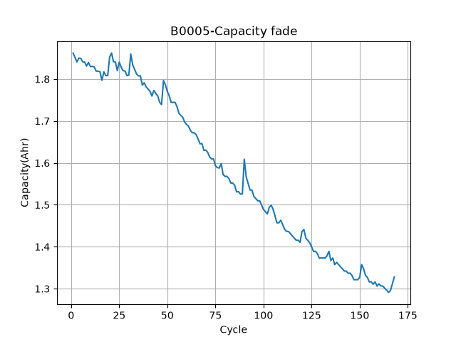
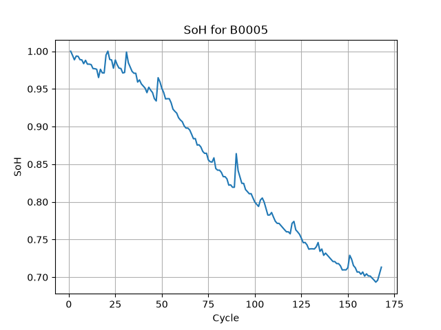
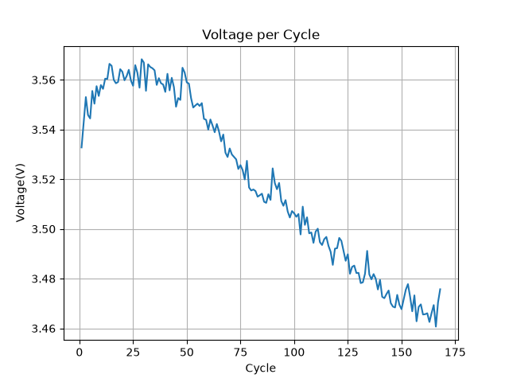
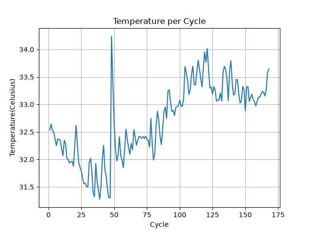
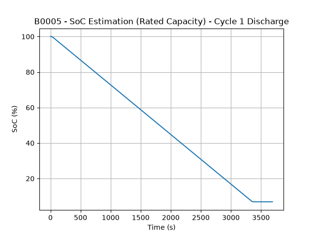
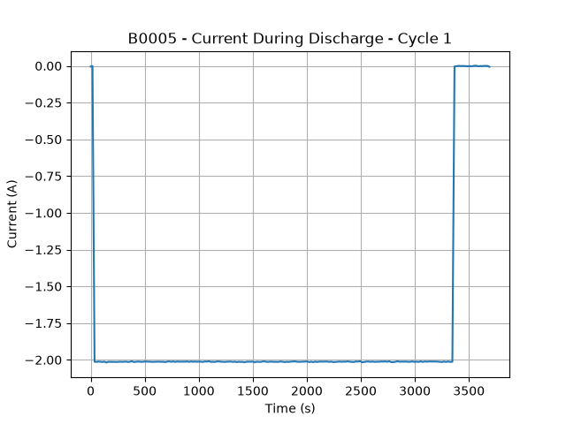
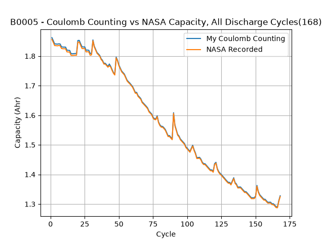
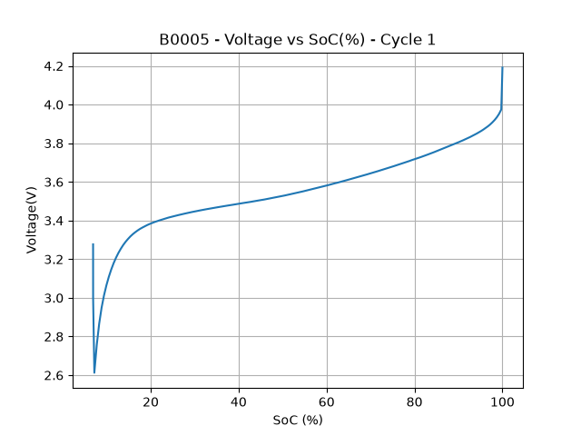

# EV Battery SoC/SoH Estimation

Estimating State of Charge (SoC) and State of Health (SoH) for lithium-ion 
batteries using NASA's Li-ion battery degradation dataset (battery B0005).

## 1. Introduction

This project implements SoH tracking, Coulomb counting, SoC estimation, and 
a quasi-OCV analysis from scratch using both a cycle-level summary dataset 
and NASA's raw sensor data, validating each method against reference values 
provided in the dataset.

**Tech stack:**
- Python
- pandas
- matplotlib
- scipy
- numpy

## 2. Dataset

Two versions of NASA's B0005 battery data were used:

- **Cycle-level CSV** — one row per completed discharge cycle (capacity, 
  average voltage, average temperature, SoH, RUL). Used for SoH validation 
  and general degradation trends.
- **Raw `.mat` file** — full time-series sensor data (voltage, current, 
  temperature measured every ~17 seconds within each individual charge and 
  discharge). Used for Coulomb counting and SoC/OCV analysis, since the CSV 
  lacks in-cycle current data.

## 3. Capacity & SoH

Capacity decreases from ~1.86 Ahr to ~1.33 Ahr over 168 cycles, 
corresponding to approximately 70% of the initial capacity. This level is 
often referenced as an End-of-Life threshold in some industry and research 
contexts, though the exact threshold varies by application and standard.

SoH was independently calculated as `capacity / capacity[0]` (ratio to 
initial capacity) and compared against the dataset's provided `soh` column — 
values matched exactly, confirming the formula and dataset are consistent.

Voltage peaks around 3.6V then trends down to ~3.46V as the battery ages — 
rising internal resistance causes voltage droop, making this a secondary 
signal for estimating SoH alongside capacity.

Temperature is noisy with a few sharp spikes, which may correlate with 
capacity recovery bumps seen in the fade curve — a known effect where heat 
temporarily restores some usable capacity in Li-ion cells.

## 4. Coulomb Counting

Implemented Coulomb counting from scratch using raw NASA `.mat` data to 
estimate charge removed during a discharge cycle.

**Method:** extracted `Current_measured` and `Time` from the raw discharge 
data, applied the trapezoidal rule to integrate current over time, and 
converted the result from Amp-seconds to Amp-hours.

**Single-cycle validation (cycle 1):**
- Calculated capacity: 1.8622 Ahr
- NASA's recorded capacity: 1.8565 Ahr
- Discrepancy: ~0.3%

The small discrepancy can arise from discrete sampling, numerical 
integration, measurement effects, endpoint handling, and differences in the 
reference capacity calculation.

## 5. SoC Estimation

Converted Coulomb counting into a running SoC estimate over a full discharge 
cycle, using two capacity references:

- **Rated capacity (2.0 Ahr, nameplate spec)** — primary SoC definition, 
  matching what real BMS systems reference
- **Measured capacity (1.862 Ahr, from Coulomb counting)** — trivially 
  approaches 0% by end of cycle since it's calibrated against itself; 
  included for comparison only

SoC drops from 100% to ~6.9% over the discharge (using rated capacity), 
consistent with the Coulomb counting result above.

Current stays roughly constant around -2.0A for most of the discharge, 
which explains why the SoC curve is nearly linear — a steady current means 
SoC drops by a roughly fixed amount at each time step. Real-world usage with 
variable current draw would produce a non-linear SoC trajectory instead.

## 6. 168-Cycle Analysis

Extended Coulomb counting from a single cycle to all 168 discharge cycles, 
generating an independent capacity estimate for the battery's entire life 
and saving results to `my_coulomb_counting_results.csv`.

**Quantitative error analysis** (my calculated capacity vs. NASA's recorded 
capacity, across all 168 cycles):

| Metric  & Value |

| Mean Absolute Error = 0.00334 Ahr |
| Root Mean Square Error = 0.00351 Ahr |
| Mean Percent Error = 0.211% |
| Max Percent Error = 0.317% |

RMSE and MAE are close in value, indicating consistent accuracy across 
cycles rather than a few outlier cycles skewing the average. Error stays 
under 0.35% even at its worst across the battery's entire life.

## 7. Voltage / Quasi-OCV Analysis

Plotted voltage against SoC for cycle 1's discharge, since Coulomb counting 
alone drifts over time and voltage-based SoC lookup is the standard 
real-world correction method.

**Important caveat:** this is not true Open Circuit Voltage, since the 
battery is under a constant ~2A load throughout discharge, never at rest. 
Under a simplified resistive model, the loaded terminal voltage can be 
approximated as `V_terminal ≈ V_OCV − I × R`. In a real cell, polarization 
and other dynamic effects also contribute to the voltage difference, so 
this is best understood as a "quasi-OCV" curve rather than a precise 
correction.

The curve shows the classic Li-ion S-shape: steep near full charge (90-100% 
SoC) and near empty (below ~15% SoC), with a flat middle region (20-90% 
SoC) where voltage is a poor indicator of SoC on its own — this is why 
Coulomb counting and voltage-based methods are complementary rather than 
interchangeable.

**Artifact near cutoff:** a small voltage recovery near SoC ~7% was verified 
against raw current data — current drops to near-zero in the final 
readings (test rig detecting cutoff), reducing the internal-resistance 
voltage drop and causing voltage to rise slightly even as SoC stays roughly 
constant. Confirmed as a real physical effect, not sensor noise.

## 8. Limitations

- Voltage data used is under load, not true rest-state OCV, so the 
  voltage-SoC curve is an approximation rather than the true OCV curve
- No drift-correction was implemented, since this project uses a static 
  historical dataset rather than continuous real-time data
- Analysis focused on a single battery (B0005); results may vary for cells 
  tested under different conditions (temperature, discharge rate)

## 9. Conclusions

Coulomb counting, implemented from scratch and validated against NASA's 
reference capacity, achieves sub-0.35% error across the battery's full 
168-cycle life. SoC estimation using rated capacity is the more meaningful 
real-world metric, since measured-capacity SoC is circular by construction. 
The voltage-SoC relationship confirmed the expected Li-ion S-curve shape, 
motivating why real BMS systems fuse Coulomb counting with voltage-based 
correction rather than relying on either method alone.

## 10. Future Work

- Investigate true OCV–SoC characterization using dedicated rest-period 
  data or an appropriate external reference dataset
- Extended Kalman Filter (EKF) fusing Coulomb counting and voltage 
  measurements for a production-realistic SoC estimator
- Cell balancing simulation for multi-cell packs